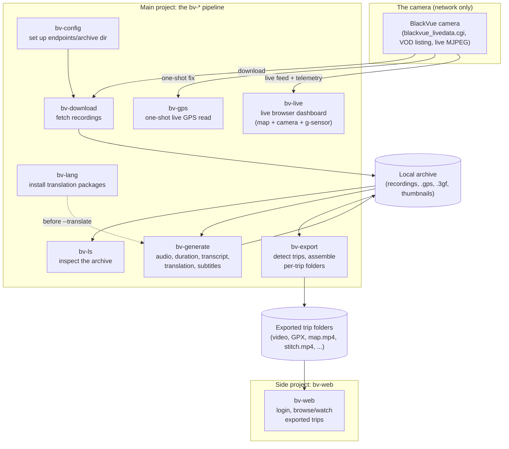

# Architecture

**Status:** Reflects the real, built system as of 2026-07-31.

This replaces an earlier version of this document (day one of the project, 2026-07-10) that described an aspirational multi-vendor "Fleet -> Vehicle -> Connection Manager -> Adapter -> Camera -> Jobs -> Storage" framework. That design was never actually built - the real project grew organically, one dated `WORKING_CONTEXT.md` entry at a time, into something more specific and considerably larger than the original sketch. This document describes what actually exists, cross-checked against the real source tree and `pyproject.toml`, the same way `docs/CLI.md` was already corrected once before for the same reason.

## What this project actually is

beyond-video is a personal toolkit for one BlackVue dashcam (single vendor, not a multi-manufacturer framework - the `adapters/` package the original design called for exists only as an empty placeholder and nothing else references it). It has two parts, deliberately kept separate:

- **The main project** (this document): a chain of `bv-*` command-line tools that download recordings from the camera, enrich them (transcripts, translations, durations), and assemble them into per-trip export folders - plus `bv-live`, a live browser dashboard for watching/monitoring the camera in real time. All of this is built to be run by one person, from their own machine, with no login or multi-user concerns.
- **`bv-web`** (side project): a small multi-user, login-protected web app for *browsing* trips `bv-export` already produced. It has its own document, `docs/WEB_ARCHITECTURE.md`, and its own deployment story in `docs/DEPLOY.md`. `bv-live` is the one piece that belongs to both - see "Where bv-live fits in" below.

## High-level diagram



Solid arrows are the core path; dotted arrows are optional steps. For the pipeline stages in the order they're normally run, with example commands, see `docs/PIPELINE.md` - this document stays at the level above that: what the pieces are and how they fit together, not the exact flags for each one (see `docs/man/` for that).

## The pipeline, briefly

`bv-config` creates a camera's configuration once (display name, one or more network endpoints tried in priority order, the local archive directory). `bv-download` is the only step that needs the camera present on the network; everything after it works purely against the local archive. `bv-ls` is a read-only view into that archive. `bv-lang` installs offline translation packages, a one-time step per language pair. `bv-generate` produces derived assets per recording (audio, real-world duration, transcript, translation, subtitles) that make the final export better but aren't required for it. `bv-export` is the last step: it groups recordings into trips (gap-based, GPS-aware) and assembles each trip into its own folder - concatenated video/audio, a merged GPX track, a merged g-sensor log, and, depending on flags, a route map, a g-sensor overlay, and a combined stitched video. Full detail, including a realistic end-to-end command sequence: `docs/PIPELINE.md`.

## Where bv-live fits in

`bv-live` is part of the main project - "a personal, run-when-you-want-it tool in the same spirit as `bv-gps`/`bv-download`," per its own module docstring - not a multi-user service. It serves one page combining the camera's own live MJPEG feed with two streams this project renders itself: a scrolling live map (`live/map_stream.py`, reusing `export/map_render.py`'s frame drawing and `export/osm_roads.py`'s Overpass fetch/cache) and a scrolling g-sensor strip (`live/gsensor_stream.py`), both fed by a background telemetry pump (`live/telemetry.py`) that reads `blackvue_livedata.cgi` continuously for as long as the server runs. No login, no archive involved at all - it talks to the camera directly and never touches downloaded recordings.

It's also the one piece that conceptually spans both projects: it shares its FastAPI/uvicorn dependency group in `pyproject.toml` with `bv-web` ("bv-live shares this group rather than getting its own: it needs the exact same fastapi/uvicorn stack, just for a different app" - see the `web` extra's own comment), even though it's a deliberately separate top-level package (`blackvue.live`, not `blackvue.web`) with none of `bv-web`'s login/multi-user machinery. `docs/WEB_ARCHITECTURE.md` cross-links back here rather than duplicating this section.

## Package layout

Real, as of this writing - grep-checked against actual imports, not aspirational:

```
src/blackvue/
    core/           Camera connection: BlackVueClient (HTTP to the camera's
                     own CGI endpoints), multi-endpoint connect() (tries each
                     configured endpoint in priority order - home WiFi before
                     a cellular fallback, say - the one surviving piece of
                     the original "Connection Manager" idea), camera config.
    parser/         Turns raw camera responses into domain objects: VOD
                     listings, live GPS/g-sensor JSON (blackvue_livedata.cgi).
    domain/         Plain dataclasses shared by core/parser (VodEntry,
                     Recording, LiveGpsFix).
    archive/        The on-disk archive: Archive/ArchiveReader (recordings
                     already downloaded), Configuration snapshots, Asset
                     bookkeeping.
    trip/           Trip/TripBuilder - groups an archive's recordings into
                     trips (gap-based, GPS/movement-aware).
    telemetry/      Readers for a recording's own sidecar files: .gps (NMEA),
                     .3gf (raw g-sensor).
    generate/       bv-generate's own derived-asset producers: audio
                     extraction, duration probing, transcription/translation
                     (faster-whisper/pyannote.audio/argostranslate, all
                     optional extras), subtitle writers.
    export/         bv-export's own trip-assembly: video concatenation,
                     GPX writing, map/g-sensor/graph rendering, the --stitch
                     camera-layout compositor, geocoding, trip stats/log/info.
    live/           bv-live's own FastAPI app, live map/g-sensor renderers,
                     the background telemetry pump, MJPEG streaming helpers.
    web/            bv-web's own FastAPI app - see docs/WEB_ARCHITECTURE.md.
    cli/            One module per bv-* command (argument parsing + wiring
                     the packages above together); the actual entry points
                     pyproject.toml's [project.scripts] points at.
    adapters/       Empty placeholder from the original day-one design -
                     unused, not referenced anywhere else in the codebase.
```

## Configuration and storage

A camera's configuration (display name, endpoints, archive directory) lives wherever `bv-config` wrote it (see `docs/man/bv-config.md`); the archive itself is a plain directory of downloaded recordings plus their own `.gps`/`.3gf`/thumbnail sidecar files, kept exactly as BlackVue's own naming convention produces them - nothing here reorganizes or renames what the camera itself wrote, so the archive stays readable by BlackVue's own software too. `bv-export --target` writes trip folders to a separate location entirely (video, audio, GPX, `trip_info.txt`, `trip.log`, and whichever optional map/g-sensor/stitch outputs were requested) - those trip folders are what `bv-web` later browses.

## Deployment

Both the main pipeline and `bv-web` can run on a single machine, or be split across a NAS (always-on, runs `bv-web` + optionally the full pipeline) and a PC (the faster path for `bv-generate`/`bv-export`'s own heavier, GPU-friendly steps). See `docs/DEPLOY.md` for the concrete split-machine setup, including which pieces make sense on which side.

## See also

- `docs/PIPELINE.md` - the CLI pipeline stage-by-stage, with example commands
- `docs/WEB_ARCHITECTURE.md` - bv-web, the side project
- `docs/DEPLOY.md` - NAS/PC deployment
- `docs/CLI.md` - options shared across commands (recording selection)
- `docs/man/` - full reference for each `bv-*` command
- `WORKING_CONTEXT.md` - the dated history of how each piece actually got built
