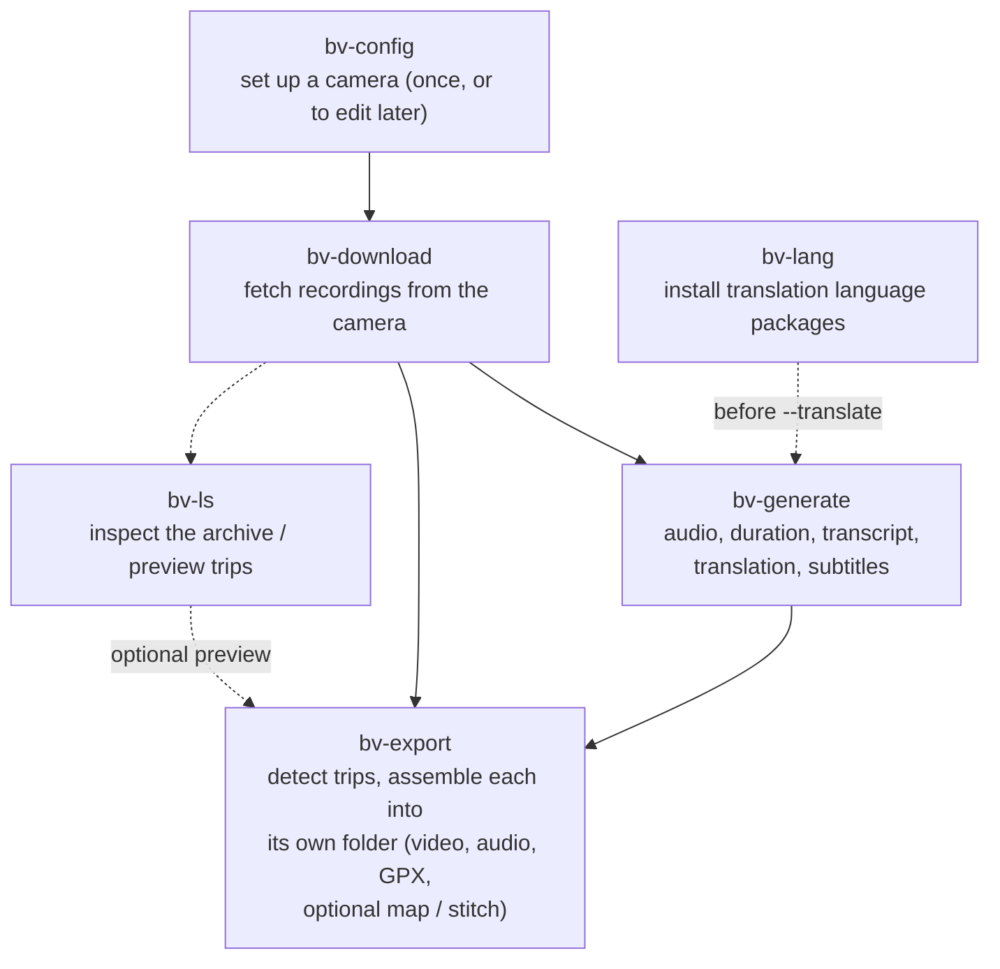

# The beyond-video pipeline

This is an overview of how the `bv-*` commands fit together, and the order they're normally run in for a single camera - from first-time setup all the way to a finished per-trip export folder. For each command's full option reference, see `docs/man/`.

## Diagram



Solid arrows are the core path. Dotted arrows are optional steps that can be skipped, run repeatedly, or run in a different order without breaking anything downstream.

## The steps, in order

### 1. `bv-config` - one-time setup

Run once per camera, before anything else can happen. Creates the camera's configuration: display name, network endpoints (tried in order), and the local directory recordings are downloaded into. Re-running it later edits the existing config.

```
bv-config Kirby
```

### 2. `bv-download` - build the local archive

The step that actually needs the camera present on the network. Downloads recordings into the target directory `bv-config` set up - by default, event/manual recordings plus context, though `--mode all` fetches everything. Safe to re-run repeatedly (e.g. daily, or via a scheduled task) - it only fetches what's genuinely new.

```
bv-download Kirby
```

Everything from here on works purely against the local archive - the camera itself is no longer involved.

### 3. `bv-ls` - inspect the archive (optional, anytime)

A read-only view into what's on disk: which recordings exist, which derived assets (from `bv-generate`) already exist for each, or - with `--trips` - a preview of how `bv-export` would group recordings into trips. Doesn't write anything, so it's safe to run at any point, as often as useful.

```
bv-ls /path/to/archive --trips
```

### 4. `bv-lang` - install translation packages (optional, only for `--translate`)

Only needed if you plan to use `bv-generate --translate`. Installs the offline language package for a given source→target language pair. A one-time step per language pair, not per recording or per run.

```
bv-lang install en sv
```

### 5. `bv-generate` - enrich recordings (optional)

Produces derived assets from each recording's own video/audio: extracted audio, real-world duration, transcript, translation, and subtitle files. Entirely optional - `bv-export` works without it - but running it first makes the export noticeably better: `--get-duration`'s span feeds trip-gap detection (so a long recording isn't mistaken for a gap to the next one), and transcript/subtitle files get merged automatically into each trip's own `trip.srt`/`trip.lrc`, available to `--stitch-subtitles`.

```
bv-generate /path/to/archive --get-duration --transcribe --srt
```

### 6. `bv-export` - assemble trips

The final step. Detects trips (runs of recordings with no gap longer than `--max-gap`) and assembles each one into its own folder: concatenated front/rear video and audio, a merged GPX track, a merged g-sensor log, and - depending on flags - a route map (`--map`/`--map-zoom`), a g-sensor overlay video (`--gsensor-video`), and a combined side-by-side/stacked/rearview-mirror video with all of the above composited together (`--stitch`).

```
bv-export /path/to/archive --target /path/to/trips --stitch --stitch-layout rearview_mirror --map
```

## A realistic end-to-end run

```
bv-config Kirby
bv-download Kirby
bv-generate /path/to/archive --get-duration --transcribe --srt
bv-export /path/to/archive --target /path/to/trips --map --stitch --stitch-layout rearview_mirror --stitch-subtitles
```

`bv-ls` and `bv-lang` aren't in that list because they're not required for it to work - `bv-ls` is worth running in between any of these steps just to see what's there, and `bv-lang install` only needs to happen once, ahead of the first `bv-generate --translate` run.

## See also

- `docs/man/bv-config.md`
- `docs/man/bv-download.md`
- `docs/man/bv-ls.md`
- `docs/man/bv-lang.md`
- `docs/man/bv-generate.md`
- `docs/man/bv-export.md`
